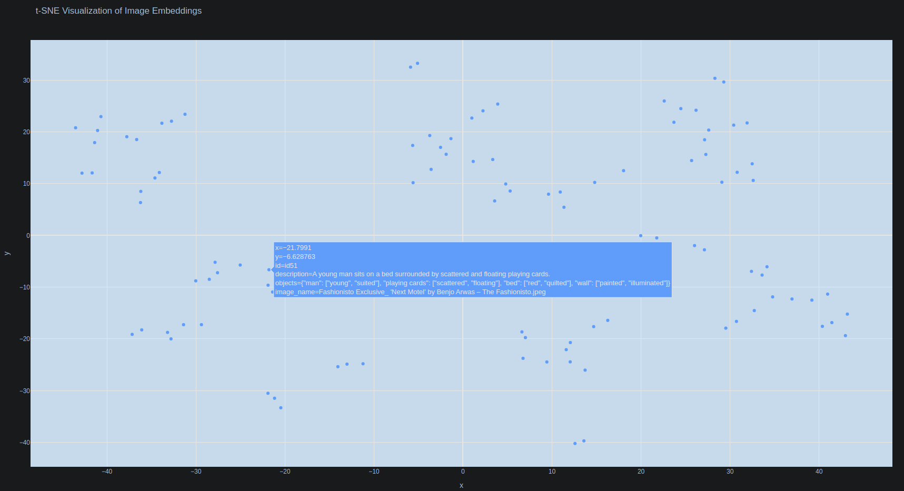
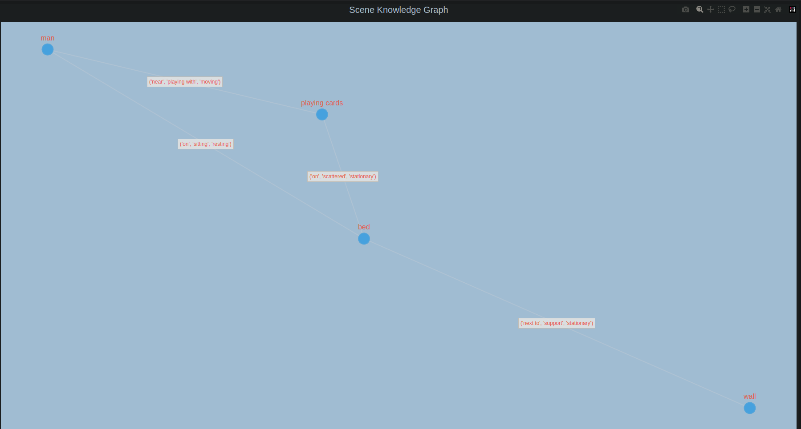

Project inspired by my G, claude 3.7 Sonnet

# Reasoning VLM( RAG for image understanding)

## Intro
the goal is to build an AI system that doesn't just label objects in images (e.g: "there's a cup") but understands and explains meaningful relationships between objects (e.g: "the cup is balancing precariously on the edge of the table, suggesting someone might have placed it there hastily").

### Core Capabilities To Develop

**Scene Understanding:** Identifies not just objects but meaningful situations

**Anomaly Detection:** Identifies unusual or important relationships


## Example

**Image:** A coffee mug placed precariously on the edge of a desk with papers scattered around

**Standard Multimodal LLM Response:**

"The image shows a white ceramic coffee mug positioned on the edge of a wooden desk. There are several papers and documents scattered across the desk surface. The mug appears to be full."

**Enhanced Visual Reasoning System:**

"The coffee mug is positioned unusually - it's placed at the edge of the desk rather than in a stable central position (this occurs in only 3% of similar desk scenes in my database). The scattered papers suggest interrupted work, and the mug's precarious position indicates the person likely placed it down hastily. Based on similar scenes, this arrangement suggests the person was likely called away unexpectedly during work and may return shortly. The mug's position creates a risk of spilling, which would damage the papers below - an atypical risk situation compared to normal desk arrangements I've analyzed."

**The key differences:**

- Identification of what's unusual based on comparison to similar scenes

- Statistical context from database of images

- Temporal reasoning about what happened before and might happen after

- Risk assessment based on learned patterns of object interactions

- Inferences about human behavior that caused this arrangement


this system doesn't just see what's there - it understands what's unusual, risky, or indicative of certain human behaviors based on comparative analysis.

## 2D t-SNE Visualization of Image Embeddings



## Knowledge Graph Visualization




## Setup

### Prerequisites

Python 3.8 or higher
Node.js 16 or higher
Git
A Google Cloud account for Gemini API access
Basic familiarity with command line operations

### Backend Setup

1. Clone the repository
```
git clone https://github.com/yourusername/visual-reasoning.git
cd visual-reasoning
```
2. Create a virtual environment
 ```  
python -m venv venv
source venv/bin/activate  # On Windows: venv\Scripts\activate
```

3. Install dependencies
```
pip install -r requirements.txt
```

4. Set up environment variables

Create a .env file in the server directory:
``` touch .env ```
add this in your .env file:
> GEMINI_API_KEY=your_gemini_api_key

### Setup Your Own Dataset

1. Initialize dataset
Add your initial pool of images to the image folder in server/images

2. Initialize your chroma DB
  Run the file server/ingestion_pipeline.py to add images from server/images and their respective metadata to your chroma db and move them to server/processed_images
  ```
  python3 server/ingestion_pipeline.py
  ```

3. Bootstrap initial feedback
  Run the file server/bootstrap_dataset_with_ai_feedback.py to create a new database for feedbacks recieved on the initial(basic) inference.
  ```
  python3 server/bootstrap_dataset_with_ai_feedback.py
  ```

4. Add images to your Image folder for testing(Optional)
   Add more images to server/images to use on the frontend (allows you to select files directly without opening a panel to select)
   

### Frontend Setup

1. Navigate to the client directory, install dependencies and go back to the root:
```
cd client
npm install
cd ..
```

### Run the App

open two windows in your terminal, one for the backend and the other for the backend.

1. Start the Backend Server
   Run the server/main.py file
   ```
    python3 server/main.py
   ```

2. Start the frontend
   ```
   cd client
   npm start
   ```

3. Hope you like it!


### Common Issues and Solutions

1. If you see module import errors  
  Ensure you're in the virtual environment  
  Try reinstalling requirements: pip install -r requirements.txt  
  
2. If the frontend can't connect to the backend  
  Check that the backend server is running on port 8000  
  Verify there are no CORS issues in the browser console  
  
3. If image analysis fails  
  Verify your Gemini API key is correct  
  Check the server logs for specific error messages  

### Testing the Installation

Open http://localhost:3000 in your browser  
Upload an image or select from existing images  
Try the basic analysis feature  
Check if the enhanced analysis works with feedback  
